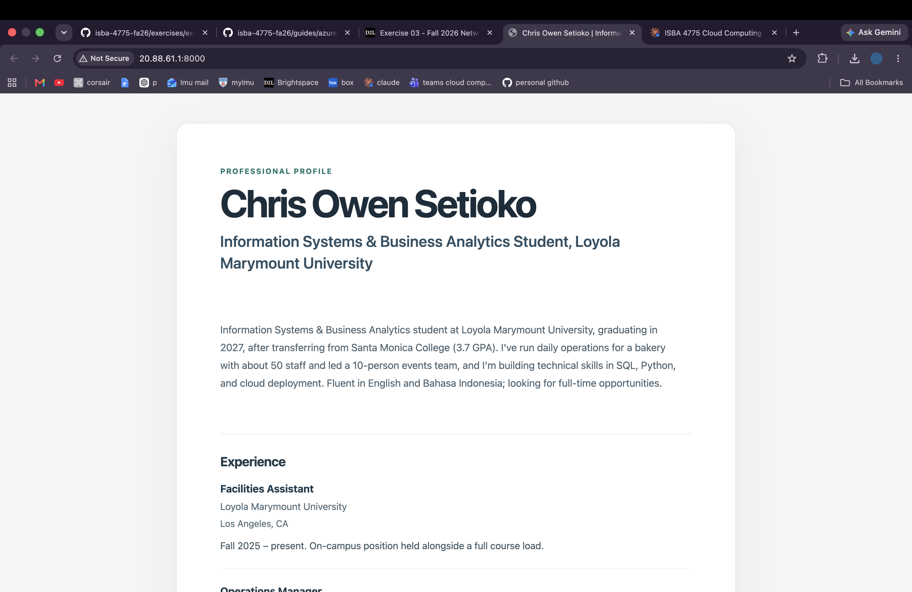

# Exercise 03 evidence

## 1. The VM

| | |
| --- | --- |
| VM name | `vm-career-platform` |
| Resource group | `rg-career-platform` |
| Region | North Central US |
| Size | `Standard_B2ats_v2` (2 vCPUs, 1 GiB) |
| Public IP | `20.88.61.1` |

## 2. My site at the VM's public IP

Taken during the two-lock step while the `Temp-HTTP-8000` rule was open.

## 3. What went wrong and how I fixed it

The guide's region was set to West US 2 and also the size B2ts V2 was not available due to the error message showing my subscription did not allow those. I checked which was available with the student subscription and i changed it to North US and also the B2ats_v2 which was the cheapest.

## 4. The change

Nothing got deleted, it was probably because of me accesing from a different ip address. I would change the source of the exisiting rule to the new Ip Address. Time would be the most costly or also security reasons since any would mean accesss.
